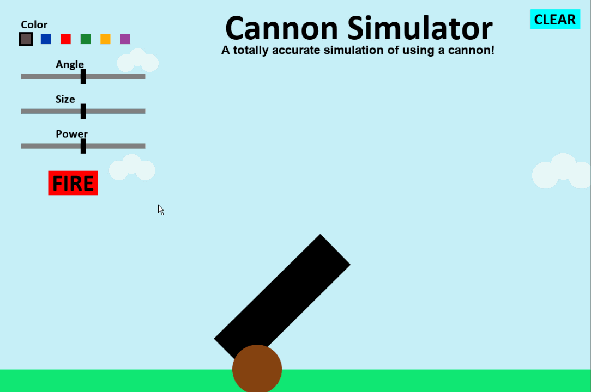

# Cannon Simulator

A simple Java game made with the Java-Swing Framework, where you shoot colorful bouncy cannonballs. You control the cannon using your mouse, which can change things like angle and size. There is no real objective in the game other than to have fun (:

## How to Run

Install [Java](https://www.java.com/en/download/) from the Oracle website, then run the **CannonSimulator.jar**

## License

This project is licensed under the MIT License - see the [LICENSE](LICENSE) file for details
